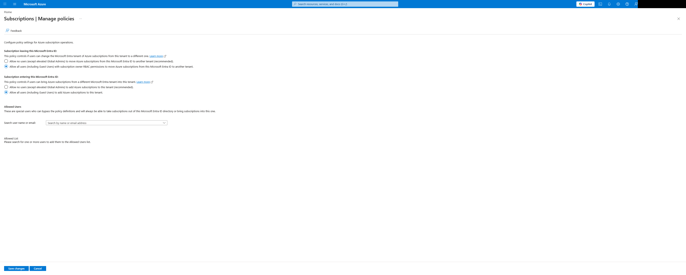

# Allow all users moving in and moving out Azure Subscriptions from your tenant




# Usage

```hcl
# Get current user properties
data "azapi_client_config" "current" {
}

module "suscription_policies" {
  source = "../.."

  # Allow all users
  enable_all_users_to_transfer_in   = true
  enable_all_users_to_transfer_out  = true

  # Empty user list
  bypass_user_list = [ ]
}
```

Then run the following commands to deploy the export:

```bash
# Init Terraform
terraform init

# Plan changes
terraform plan

# Apply
terraform apply
```

<!-- BEGIN_TF_DOCS -->
## Requirements

| Name | Version |
| ---- | ------- |
| <a name="requirement_terraform"></a> [terraform](#requirement\_terraform) | ~> 1.15 |
| <a name="requirement_azapi"></a> [azapi](#requirement\_azapi) | ~> 2.10 |

## Providers

No providers.

## Modules

| Name | Source | Version |
| ---- | ------ | ------- |
| <a name="module_suscriptions_policies"></a> [suscriptions\_policies](#module\_suscriptions\_policies) | ../.. | n/a |

## Resources

No resources.

## Inputs

No inputs.

## Outputs

| Name | Description |
| ---- | ----------- |
| <a name="output_resource"></a> [resource](#output\_resource) | The full Subscriptions Policies azapi\_update\_resource. |
| <a name="output_resource_id"></a> [resource\_id](#output\_resource\_id) | The ID of the Subscriptions Policies. |
<!-- END_TF_DOCS -->
